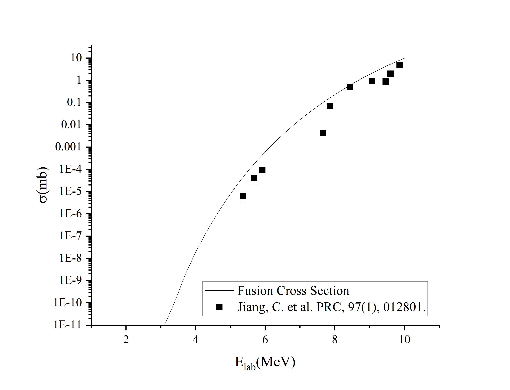

# ¹²C + ¹²C → ²⁴Mg Nuclear Reaction Study

## Table of Contents
- [Team Members](#team-members)
- [Objectives](#objectives)
- [Experimental Procedure](#experimental-procedure)
- [Results](#results)

---

## Team Members
- Jessica Chaves
- Jorge Gomez
- Araceli Garcia Flores

---

## Objectives
1. Investigate the cross-section (σ) of the ¹²C + ¹²C → ²⁴Mg reaction in the center-of-mass energy range 1–5 MeV.
2. Analyze influence of excited states on the fusion cross-section.
3. Compare experimental data with theoretical predictions or literature values.

---

## Procedure

---

## Results

## Repository Structure
